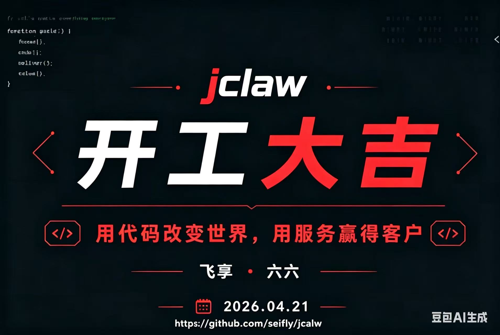
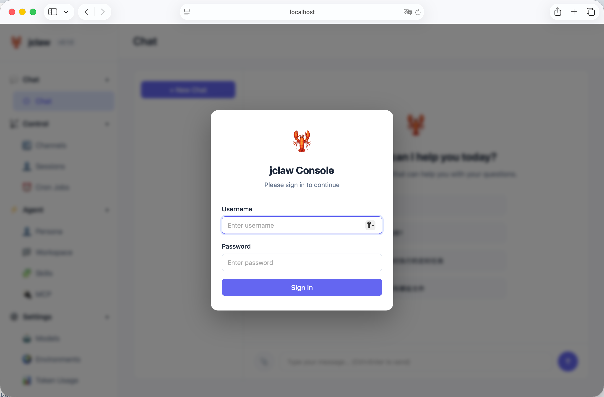
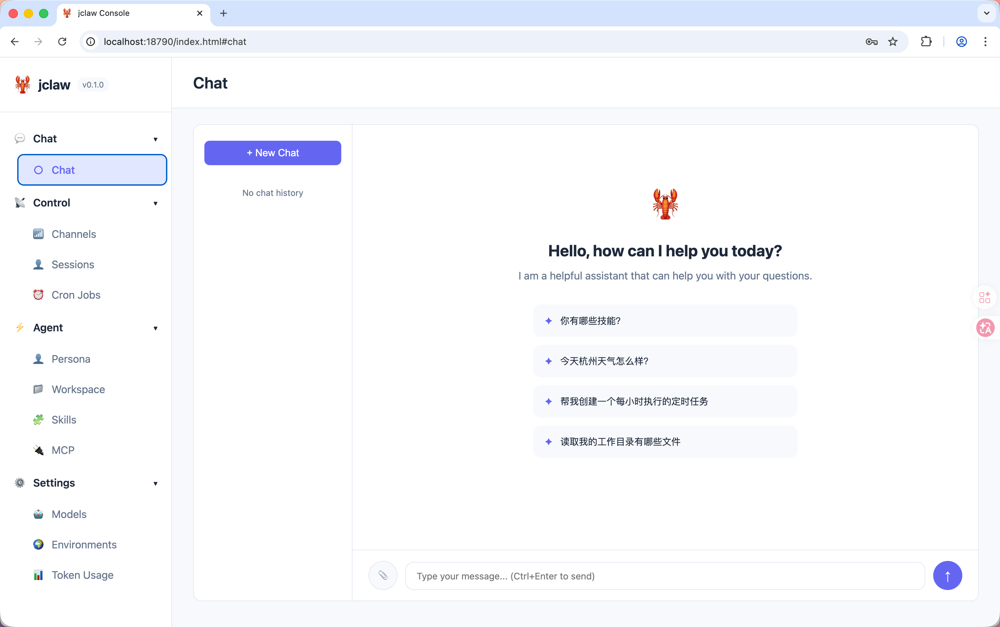
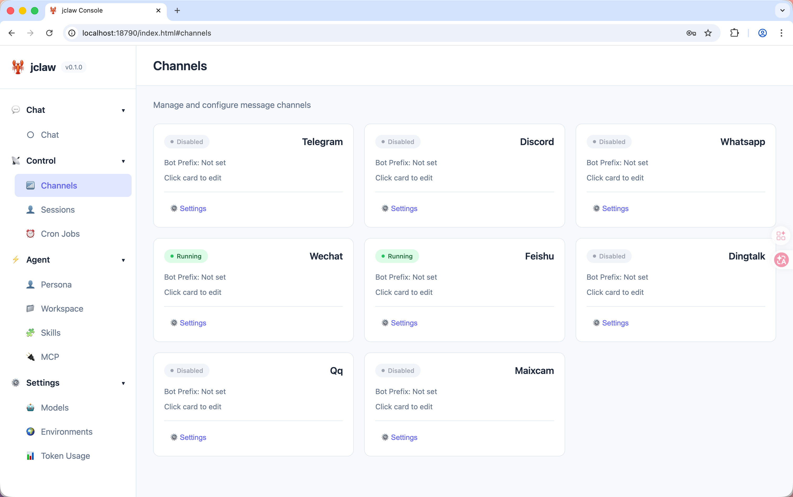
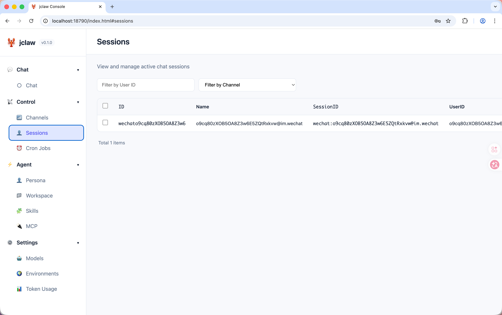
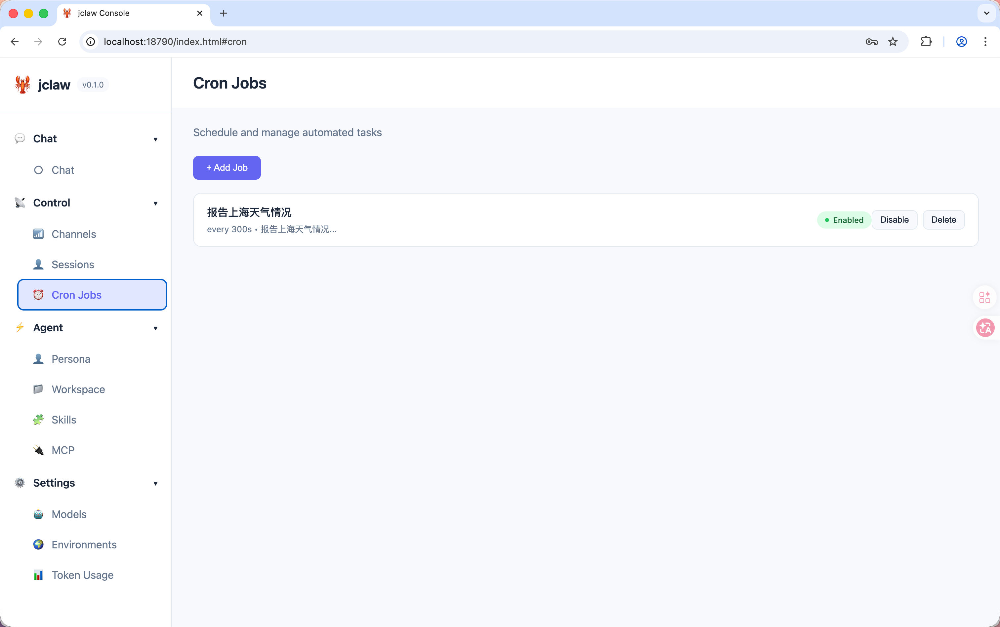
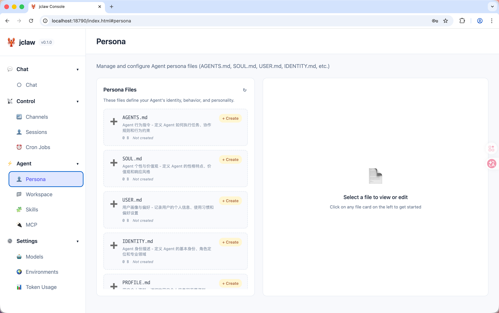
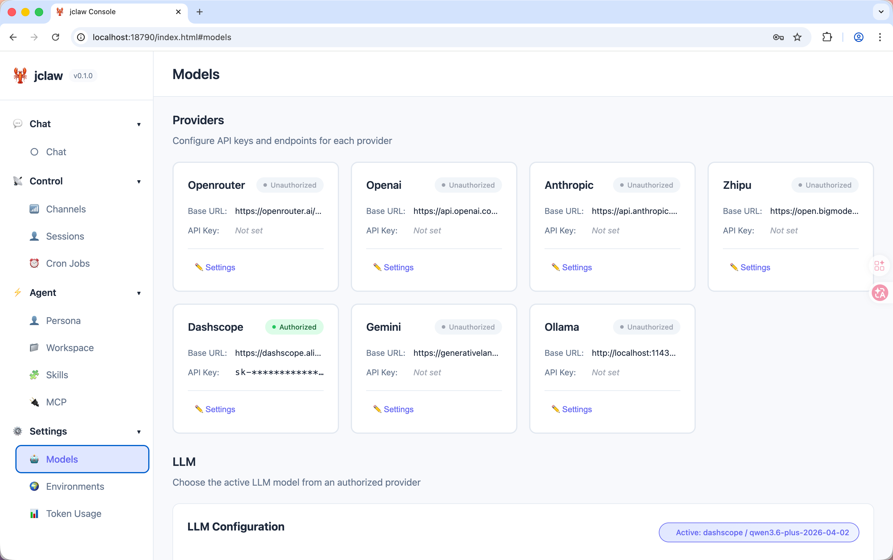
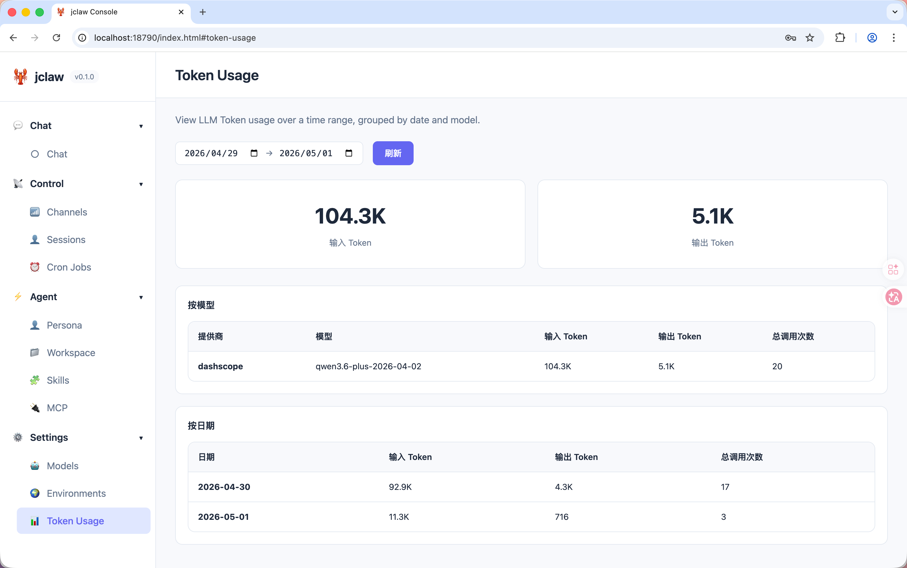

<div align="center">

# 🦞 jclaw

**Java版本openClaw** — 用多种技术框架编写，支持多模型、多通道、多 Agent 协同、自我进化的一站式 AI Agent 软件

[](https://openjdk.org/)
[](https://maven.apache.org/)
[](LICENSE)
[]()

</div>

---

### ✨ 特性一览

- **🤖 多模型支持** — 接入 OpenRouter、OpenAI、Anthropic、智谱 GLM、Gemini、阿里云、Groq、Ollama 等主流 LLM 提供商
- **💬 多通道消息** — 同时连接 Telegram、Discord、WhatsApp、飞书、钉钉、QQ、MaixCam 等平台
- **🤝 多 Agent 协同** — 7 种协同模式（辩论/团队/角色扮演/共识/层级/工作流/动态路由），内置工作流引擎
- **🧬 自我进化** — 3 种 Prompt 自动优化策略（文本梯度/OPRO/自我反思）+ 记忆进化 + 反馈收集
- **🔌 MCP 协议** — 完整的 MCP 客户端，支持 SSE、Stdio、Streamable HTTP 三种传输方式
- **🛠️ 丰富的内置工具** — 文件读写、Shell 执行、网络搜索、网页抓取、定时任务、子代理、Token 统计等 15 个工具
- **🧩 技能插件系统** — 通过 Markdown 定义技能，支持语义搜索匹配、从 GitHub 安装，Agent 可自主创建和改进技能
- **⏰ 定时任务引擎** — 支持 Cron 表达式、固定间隔和单次定时
- **🧠 记忆与上下文** — 长期记忆存储、会话摘要、分段式上下文构建
- **💓 心跳服务** — 定期自主思考，让 Agent 保持"活跃"
- **🎤 语音转写** — 集成阿里云 DashScope Paraformer，支持语音消息自动转文字
- **🔒 安全沙箱** — 工作空间限制 + 命令黑名单 + Web 安全中间件，生产级安全防护
- **🌐 Agent 社交网络** — 支持接入 ClawdChat.ai，与其他 Agent 通信协作
- **🖥️ Web 控制台** — 内置 Web UI，16 个 REST API，可视化管理 Agent 状态、会话、模型、技能等

---

### 🎯 项目重点：所有配置通过页面设置

jclaw 的核心设计理念之一是**零配置文件操作**。所有配置均可通过 Web 控制台完成，无需手动编辑 JSON 或 Markdown 文件：

| 配置类型 | 支持的页面操作 |
|----------|----------------|
| **LLM 模型配置** | ✅ 通过页面添加 API Key、选择模型、运行时热切换 |
| **通道配置** | ✅ 通过页面配置 Telegram/Discord/飞书/钉钉等平台凭证 |
| **Agent 人格配置** | ✅ 通过页面编辑 AGENTS.md、SOUL.md、USER.md、IDENTITY.md |
| **技能管理** | ✅ 通过页面查看、创建、编辑、删除技能 |
| **定时任务** | ✅ 通过页面创建、编辑、删除 Cron 任务 |
| **MCP 服务器** | ✅ 通过页面添加、配置、管理 MCP 服务器连接 |
| **文件管理** | ✅ 通过页面浏览、编辑、上传工作空间文件 |
| **环境参数** | ✅ 通过页面设置 Max Tokens、Temperature、Heartbeat 等参数 |

**无需记忆配置文件路径，无需手动编写 JSON，所有操作均在浏览器中完成！**

---

### 🔄 多版本实现

jclaw 提供三种不同技术栈的实现版本，当前仓库为 ✋ 全手工实现版本，其他版本只需要checkout不同分支：

#### 版本对比

| 特性 | 🍃 Spring AI 版本 | 🤖 AgentScope 版本            | ✋ 全手工实现版本 |
|------|-------------------|-----------------------------|-------------------|
| **技术栈** | Spring AI + Spring Boot | AgentScope (java) + Java 封装 | 纯 Java 原生实现 |
| **定位** | 企业级快速开发 | 多 Agent 协同配合                | 深度定制与学习 |
| **依赖** | 重量级 Spring 生态 | 依赖 AgentScope 环境                | 零依赖（除基础库） |
| **可定制性** | 中等 | 较高                          | 最高 |
| **学习价值** | 学习 Spring AI 生态 | 学习多 Agent 协同模式              | 学习底层原理 |

---

### ⚠️ 重要声明与风险提示

> **⚠️ 本项目仅供学习、研究和实验用途，严禁用于生产环境！**
>
> - 🎓 **学习用途**：本软件旨在帮助开发者理解 AI Agent 架构、多模型集成、消息通道适配等技术概念
> - 🚫 **禁止生产使用**：请勿将本软件应用于生产环境、商业场景或关键业务系统。
> - ⚡ **安全风险**：尽管软件内置了安全沙箱机制，但作为实验性系统，仍可能存在未发现的安全漏洞和风险
> - 💥 **责任自负**：使用本软件造成的任何数据丢失、系统损坏、安全事故或其他损失，均由使用者自行承担全部责任
> - 🔧 **稳定性风险**：本软件处于早期开发阶段，API 可能随时变更，不保证向后兼容性
> - 📢 **免责声明**：作者和贡献者不对因使用本软件而产生的任何直接或间接损失承担责任

---

---
### 📦 项目架构

```
src/main/java/cn/seifly/jclaw/
├── jclaw.java                    # 应用入口，命令注册与分发
├── agent/                           # Agent 核心引擎
│   ├── AgentLoop.java               #   生命周期管理与消息消费主循环
│   ├── MessageRouter.java           #   消息路由（用户/系统/指令）
│   ├── ProviderManager.java         #   LLM Provider 管理与热重载
│   ├── LLMExecutor.java             #   LLM 调用与工具迭代循环
│   ├── ContextBuilder.java          #   分段式上下文构建
│   ├── SessionSummarizer.java       #   会话摘要与上下文压缩
│   ├── context/                     #   上下文分段模块（Identity/Bootstrap/Tools/Skills/Memory）
│   └── evolution/                   #   自我进化引擎（PromptOptimizer/FeedbackManager/MemoryEvolver）              
├── bus/                             # 消息总线（发布/订阅，入站/出站队列）
├── channels/                        # 消息通道适配器（7 种平台）
├── collaboration/                   # 多 Agent 协同编排（7 种模式 + 工作流引擎）
├── config/                          # 配置模型与加载（11 个配置类）
├── cron/                            # 定时任务引擎
├── heartbeat/                       # 心跳服务
├── logger/                          # 结构化日志封装
├── mcp/                             # MCP 协议集成（3 种传输方式）
├── providers/                       # LLM 调用抽象（HTTPProvider + StreamEvent）
├── security/                        # 安全沙箱（SecurityGuard）
├── session/                         # 会话管理与持久化
├── skills/                          # 技能系统（加载/注册/搜索/安装）
├── tools/                           # Agent 工具集（15 个内置工具 + MCP 桥接）
├── util/                            # 工具类
├── voice/                           # 语音转写（AliyunTranscriber）
└── web/                             # Web 控制台（16 个 REST API Handler）
```

---

### 🚀 快速开始

#### 环境要求

- **Java 17** 或更高版本
- **Maven 3.x**
- 至少一个 LLM API Key（推荐 [OpenRouter](https://openrouter.ai/keys) 或 [智谱 GLM](https://open.bigmodel.cn/)）

#### 1. 构建项目

```bash
git clone https://github.com/seifly/jcalw.git
cd jclaw
mvn clean package -DskipTests
```

构建完成后，可执行 JAR 位于 `target/jclaw-0.1.0.jar`。

#### 2. 启动jar包

```bash
java -jar target/jclaw-0.1.0.jar
```

#### 3. 初始化配置

编辑 `~/.jclaw/config.json` 

### 🖥️ Web 控制台配置

访问 `http://localhost:18790` 可使用 Web 控制台，提供直观的可视化管理界面：

#### 界面概览

jclaw Web 控制台采用现代化的左侧导航栏 + 右侧内容区布局，包含以下主要功能模块：

| 模块 | 功能描述 |
|------|----------|
| **Chat** | 实时对话界面，支持 SSE 流式输出、图片上传、快速提示 |
| **Channels** | 消息通道管理，监控各平台连接状态 |
| **Sessions** | 会话管理，查看和管理活跃聊天会话 |
| **Cron Jobs** | 定时任务管理，创建和调度自动化任务 |
| **Persona** | Agent 人格配置，编辑 AGENTS.md、SOUL.md 等文件 |
| **Workspace** | 工作空间文件管理，浏览和编辑工作目录文件 |
| **Skills** | 技能管理，查看和管理 Agent 技能 |
| **MCP** | MCP 服务器管理，配置和管理 MCP 协议连接 |
| **Models** | 模型配置，选择和切换 LLM 模型与提供商 |
| **Token Usage** | Token 用量统计，查看 Token 消耗情况 |
| **Environments** | Agent 环境配置，设置运行参数 |

#### 核心界面展示



#### 登录认证
Web 控制台支持用户名密码登录认证，初始用户名密码为 `admin`/`123456`，请务必修改确保访问安全。

##### 1. 实时对话界面
支持 SSE 流式输出、图片上传、快速提示等功能，提供流畅的对话体验。



##### 2. 消息通道管理
监控 Telegram、Discord、飞书、钉钉等各平台消息通道的连接状态。



### 💬 支持的消息通道

| 通道 | 配置字段 | 所需凭证 |
|------|----------|----------|
| Telegram | `channels.telegram` | Bot Token |
| Discord | `channels.discord` | Bot Token |
| WhatsApp | `channels.whatsapp` | Bridge URL |
| 飞书 | `channels.feishu` | App ID + App Secret |
| 钉钉 | `channels.dingtalk` | Client ID + Client Secret |
| QQ | `channels.qq` | App ID + App Secret |
| MaixCam | `channels.maixcam` | Host + Port |

每个通道都支持 `allowFrom` 白名单配置，确保只有授权用户可以与 Agent 交互。

##### 3. 会话管理
查看和管理所有活跃聊天会话，支持按用户 ID、通道筛选。



##### 4. 定时任务管理
创建和管理定时任务，支持 Cron 表达式、固定间隔等调度方式。



##### 5. Agent 人格配置
编辑 AGENTS.md、SOUL.md、USER.md、IDENTITY.md 等文件，定义 Agent 的身份、行为和个性。



##### 6. 模型配置
选择和切换 LLM 模型与提供商，支持运行时热重载，无需重启即可切换模型。



### 🔌 支持的 LLM 提供商

| 提供商 | 配置字段 | 说明 |
|--------|----------|------|
| [OpenRouter](https://openrouter.ai/) | `providers.openrouter` | 聚合多模型网关，推荐首选 |
| [OpenAI](https://platform.openai.com/) | `providers.openai` | GPT 系列模型 |
| [Anthropic](https://www.anthropic.com/) | `providers.anthropic` | Claude 系列模型 |
| [智谱 GLM](https://open.bigmodel.cn/) | `providers.zhipu` | GLM-4 系列，国内推荐 |
| [Google Gemini](https://ai.google.dev/) | `providers.gemini` | Gemini 系列模型 |
| [Groq](https://groq.com/) | `providers.groq` | 超快推理 |
| [Ollama](https://ollama.ai/) | `providers.ollama` | 本地部署开源模型 |
| [阿里云 DashScope](https://dashscope.aliyun.com/) | `providers.dashscope` | Qwen 系列模型（通义千问） |

所有提供商均通过统一的 `HTTPProvider` 适配 OpenAI 兼容 API 格式，切换模型只需修改配置。

##### 7. Token 用量统计
查看 LLM Token 消耗情况，支持按日期、模型分组统计，帮助了解使用成本。




---

### 🗂️ 工作空间结构

```
~/.jclaw/
├── config.json              # 主配置文件
├── workspace/
│   ├── AGENTS.md            # Agent 行为指令
│   ├── SOUL.md              # Agent 个性与价值观
│   ├── USER.md              # 用户画像与偏好
│   ├── IDENTITY.md          # Agent 身份描述
│   ├── memory/              # 长期记忆
│   │   ├── MEMORY.md
│   │   └── HEARTBEAT.md
│   ├── sessions/            # 会话持久化
│   ├── skills/              # 用户技能
│   ├── cron/                # 定时任务
│   │   └── jobs.json
│   ├── evolution/           # 进化数据
│   │   └── prompts/         # Prompt 变体
│   └── collaboration/       # 协同记录
```
---

### 🛣️ 技术栈

| 组件 | 技术                        |
|------|---------------------------|
| 语言 | Java 17                   |
| 构建 | Maven3                    |
| HTTP 客户端 | OkHttp 4.12               |
| JSON 处理 | Jackson 2.17              |
| 日志 | SLF4J + Logback           |
| 命令行 | JLine 3.25                |
| 定时任务 | cron-utils 9.2            |
| 环境变量 | dotenv-java 3.0           |
| 测试 | JUnit 5.10 + Mockito 5.10 |

---

### 🔗 参考项目
- [mateclaw](https://github.com/matevip/mateclaw) — MateClaw is the whole widget. One deployment. Reasoning, knowledge, memory, tools...
- [javaClaw](https://github.com/laixiaoxing2026/javaClaw) — 参照 openClaw 原理使用 Java 8 重写的超轻量个人 AI 助手
- [TinyClaw](https://github.com/Leavesfly/TinyClaw) — 轻量级 AI Agent 框架，提供多模型支持和工具集成

---

### 💬 进群讨论

欢迎扫描下方二维码加入微信交流群，与其他开发者一起交流学习、分享经验、解答问题：

<div align="center">

</div>

**群内福利：**
- 📚 最新技术资讯分享
- 💡 项目开发经验交流
- 🐛 问题解答与技术支持
- 🌐 认识志同道合的开发者

---

### 📄 License

[Apache License 2.0](https://opensource.org/licenses/apache-2.0). No asterisks.